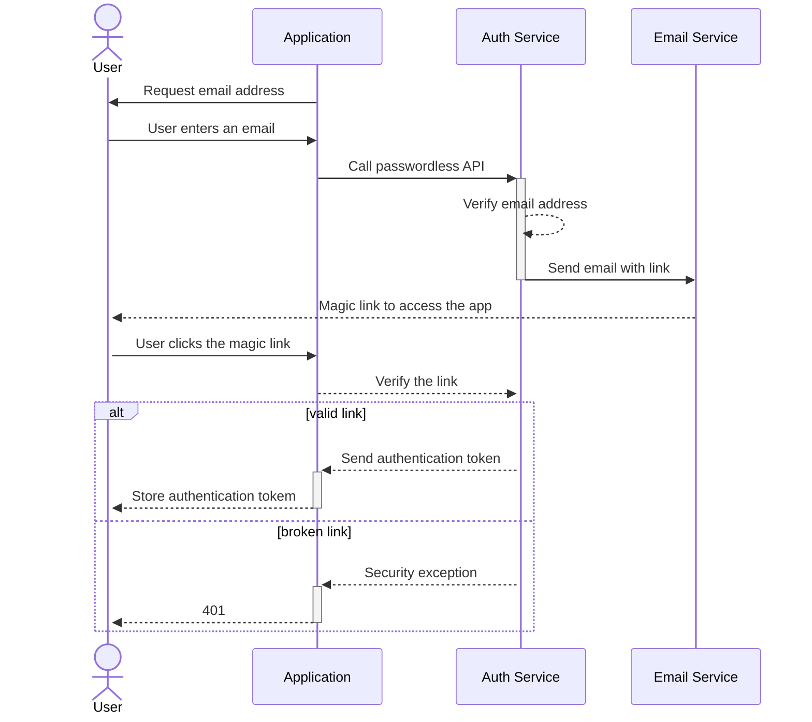

## Title:
ADR-1: Use Passwordless With Magic links as a main Authentication style 

## Status:
Proposed

## Context:
Passwords haven’t been safe for a long time. They are hard to remember, and easy to misplace. They are also the number one target of cybercriminals. So much so that 81 percent of breaches involve weak or stolen passwords.

If a website or app has a traditional password-based login process, you have to search your memory (or password manager) for the unique username and password you made for that specific account.
Magic links, however, don’t need you to remember anything at all. Just type in your email address, get a link emailed to you, click on it, and you’re in.

## Decision:
A passwordless magic link allows you to log in directly with the help of a link that is received through an email. This process is similar to when you receive a one-time-password (OTP) though you might have to physically enter the OTP once you are redirected to the page or application. 
In the case of passwordless magic links, all you have to do is click on the link sent through an email, allowing you to log in directly.

Passwordless magic links follow three steps that enable the user a hassle-free login. The three steps are as follows.

- When a consumer is about to log in/ sign in, they go to the sign-in screen and enter their email address.
- If the email address entered is a registered type, they will receive the magic link through the email provided.
- To complete the sign-in process, they have to click on the link received through the entered email.

### Optimizing your magic link emails
1. Provide one-time use links   One way to keep magic links safe and effective is to allow them to be used only once. Setting your magic links as one-time-use links will prevent sharing, both authorized and unauthorized. This is a smart move in a variety of settings, but especially when using magic links to let users access sensitive or proprietary information.
2. Set expiration dates for links   Another way to reduce the risks associated with magic links is by setting expiration dates, meaning that links can remain valid for a window of time of your choosing (1 hour is a common choice) and then deactivate automatically.
   Typically, if a user clicks an expired magic link, they’ll land on a page that will let them generate a new one

## Consequences:
- Since the security is tied with the user's account, it is wise that the email account is protected with multi-factor authentication
- Email deliverability dependent
  Magic links rely heavily on the email provider you use to send them: missing emails will prevent users from logging in, and slow emails might lead to user abandonment or distraction. So choose your email delivery service wisely