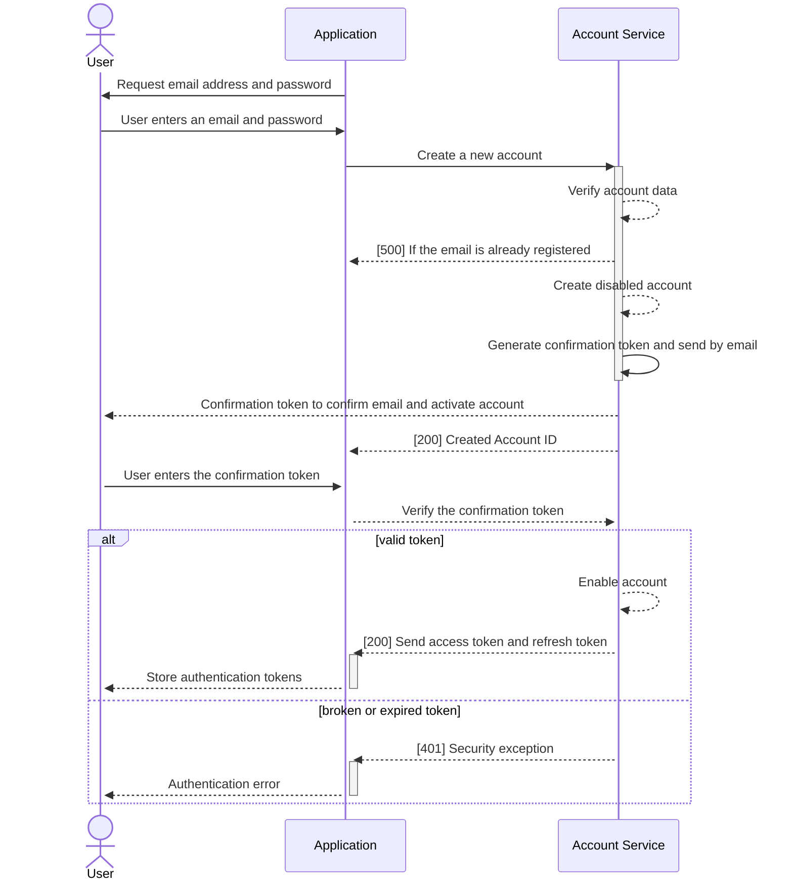

## Title:
ADR-1: Use JWT tokens for authentication and authorization 

## Status:
Proposed

## Context:
Use a traditional password-based login process as a main authentication schema.
Last version relied on Keycloak as an identity provider. The Keycloak stores users, map roles and grant permissions.

Pros:
- It supports Oauth2 and OpenId protocols
- Documentation
- Console for user management
- Console for self-registration

Cons:
- Additional component in the system to maintain
- Users are stored in the separated DB used by Keycloak
- Need to use Keycloak API to interact with users

## Decision:
Implement a custom authentication solution base on JWT tokens. The account-service will register new accounts and generate 
authentication tokens.

- When a consumer is about to sign up, they go to the sign-up screen and enter their email address and password.
- If the email address entered is a registered type, they will receive the confirmation code through the email provided.
- To complete the sign-up process, they have to enter the confirmation code received through the entered email.
- The response will contain a valid access token to call backend API and refresh token to get a new pair of tokens without requiring username/password form

### Optimizing your confirmation code emails
- Provide one-time use code.

One way to keep confirmation code safe and effective is to allow them to be used only once. 
Setting your confirmation code as one-time-use code will prevent sharing, both authorized and unauthorized. 
This is a smart move in a variety of settings, but especially when using confirmation code to let users access sensitive or proprietary information.
- Set expiration dates for tokens 

Another way to reduce the risks associated with confirmation token is by setting expiration dates, meaning that links can remain valid for a window of time of your choosing (1 hour is a common choice) and then deactivate automatically.
Typically, if a user enters an expired tokens, they’ll land on a page that will let them generate a new one

## Consequences:
- Since the security is tied with the user's account, it is wise that the email account is protected with multi-factor authentication
- Email deliverability dependent
  Confirmation code rely heavily on the email provider you use to send them: missing emails will prevent users from logging in, and slow emails might lead to user abandonment or distraction. So choose your email delivery service wisely