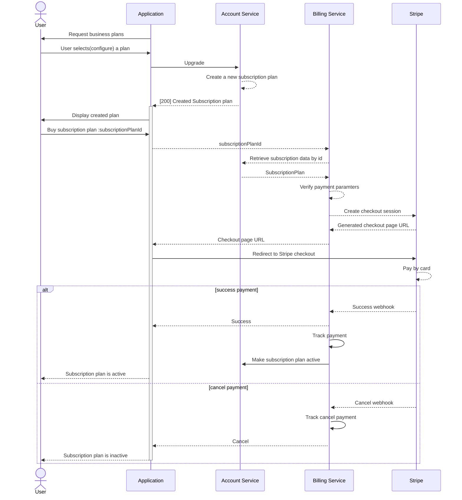

## Title:
ADR-3: Upgrade(buy) subscription plan

## Status:
Proposed

## Context:
The system offers some features as paid privileges and an account should buy them to enable all features.
By default, an employer has limited access to cancidate data, and he needs to use unlocks to get access to concat and resume.
Unlock is a privilege.

## Decision:
A system account can buy some privileges to use in the job market application.
The privileges are:
- unlocks
- feature jobs
- favourites
- etc

The privileges are grouped into a subscription the account can buy.

The systems support business plans:
- Promo (account does not need to pay)
- Paid (some privileges are grouped into one pack and has a price)
- Custom (account can choose required privileges). 

In custom plan each privilege has a unique price per count and the total price is calculated as
```shell
sum of all privileges(privilege_count * privilege_price_per_count)
```

Sequence diagram 

