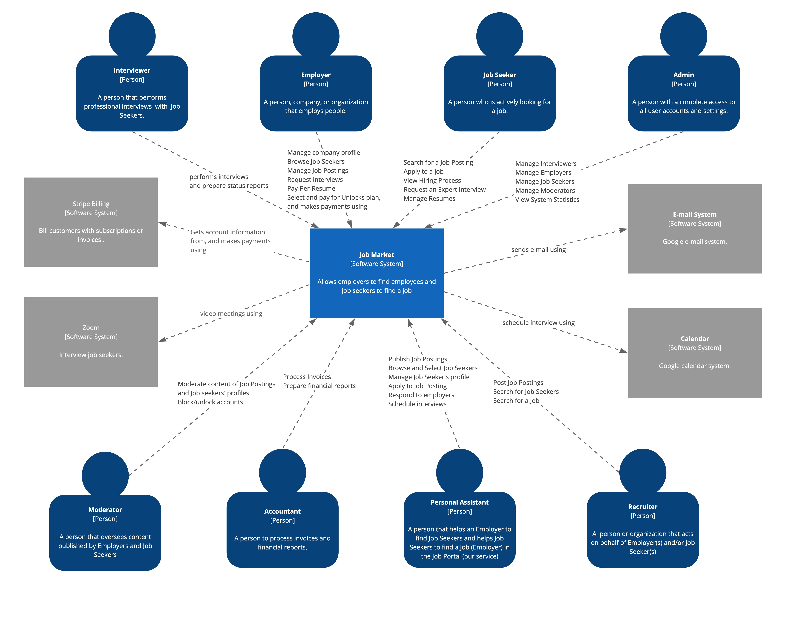
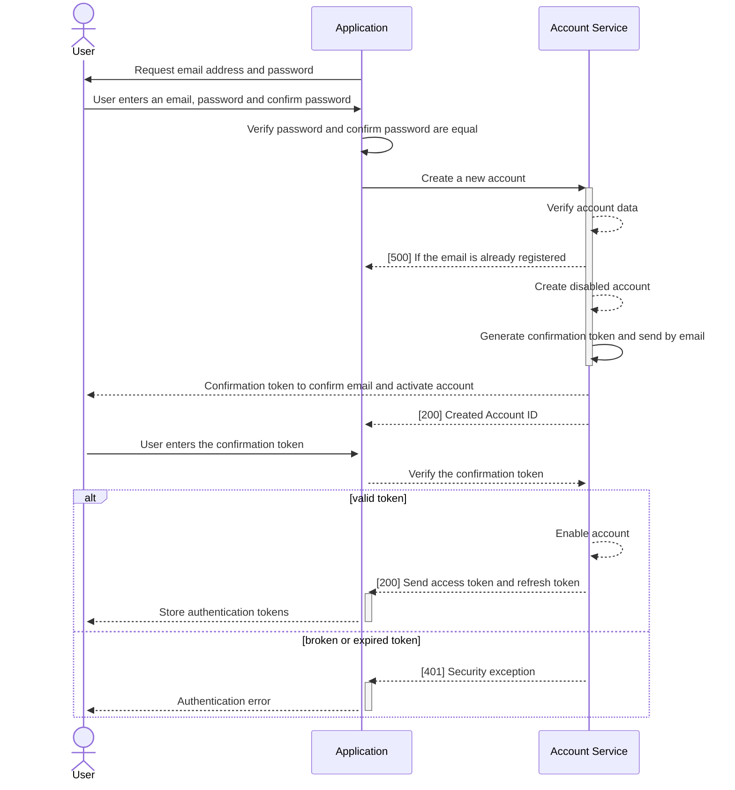
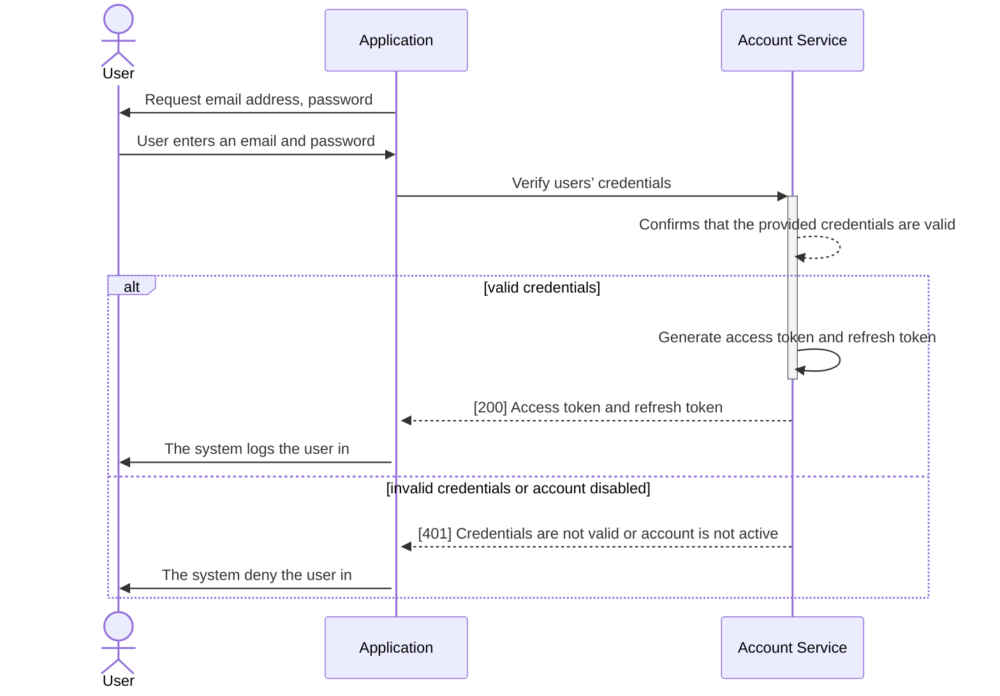
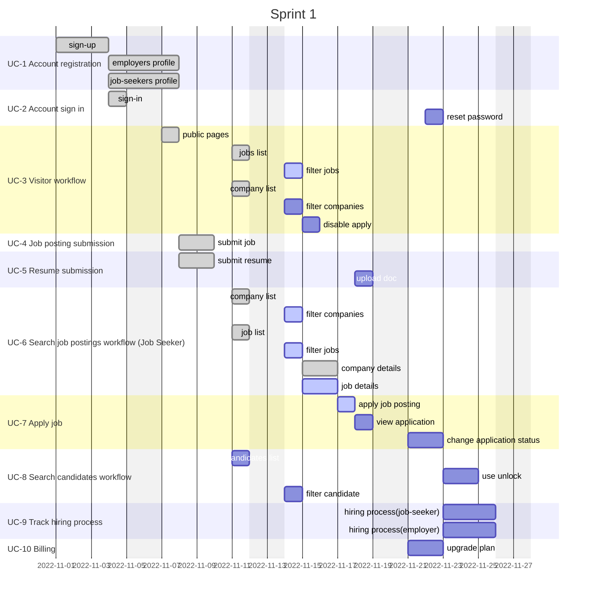

# Job Market System

## Welcome

> *Everything in software architecture is a trade-off.  
First Law of Software Architecture*

This page is architectural documentation for the solution proposal from **Team**.

## Business Case
[Glossary](glossary.md) Glossary

## System Requirements

### Stakeholders

This section describes key stakeholders of the system and their architectural concerns.

* **SH-1**: **Administrator** (security)
    - security is the second name for an administrator; these people deal with user accounts and the billing system.

* **SH-2**: **Account** (availability, performance, scalability, robustness)
    - accounts want the system they're accessing is available anytime they want to use it, and that it responses quickly
      to their actions;

* **SH-3**: **Employer** (availability, performance, scalability, robustness)
    - employers want to track clear and transparent hiring process for their job postings.

* **SH-4**: **Job seeker** (availability, performance, scalability, robustness)
    - job-seekers want to track clear and transparent hiring process.

* **SH-5**: **Visitor** (availability, performance, scalability, robustness)
    - Visitors want to have access job postings and public pages;
    - Don't need to sign-up and sign-in;

### Functional Requirements

* **UC-1**: **Account registration**:
    - accounts register their profile (SH-2);
    - employers register their profile and selects a plan (SH-3);
    - job-seekers register their profile (SH-4);

* **UC-2**: **Account sign in**:
    - accounts sign-in the system using their email and password combination (SH-3, SH-4) ;
    - accounts can request a generation of a reset password link sent by email (SH-3, SH-4);
    - accounts can change their password using reset password link (SH-3, SH-4);

* **UC-3**: **Visitor workflow**:
    - visitors can browse the main, how-it-works page and public pages; (SH-5)
    - visitors can search job-posting; (SH-5)
    - visitors can view job-posting details; (SH-5)
    - visitors can search companies; (SH-5)
    - visitors don't allowed to apply the job; (SH-5)
    - visitors can create a job-seeker and employer accounts; (SH-5)

* **UC-4**: **Job posting submission**:
    - employer fills out and submits job posting details; (SH-3)

* **UC-5**: **Resume submission**:
    - job-seeker submits a resume as an attachment; (SH-4)

* **UC-6**: **Search job postings workflow**:
    - job-seeker can use filters to search companies; (SH-4, SH-5)
    - job-seeker can use filters to search job postings; (SH-4, SH-5)
    - job-seeker can view company details and its job postings; (SH-4, SH-5)
    - job-seeker can view job posting details; (SH-4, SH-5)

* **UC-7**: **Apply job**:
    - job-seeker apply for a job posting; (SH-4)
    - employer receives job-seeker's application; (SH-3)
    - employer changes applicant status (Interested -> Yes - No); (SH-3)

* **UC-8**: **Search candidates workflow**:
    - employer can use filters to search candidates; (SH-3)
    - employer can use unlocks to view candidate details; (SH-3)

* **UC-9**: **Track hiring process**:
    - job-seeker can track his applies; (SH-4)
    - employer can track steps of the hiring process; (SH-3)

* **UC-10**: **Billing**:
    - employer can renew (buy) plan if he used all unlocks; (SH-4)

* **UC-N**: **User maintenance**:
    - administrator maintains internal user accounts (SH-1);
    - administrator maintains interviewer skillset, location, and availability (SH-1);

## Baseline Architecture
---
This section describes the architecture of the current jobmarket system.

Please note that all views are documented in C4 model style, although only System Context, Container and dynamic views
are presented. The most diagrams use informal notation style. All diagrams are supplied with a key explaining meaning of
each shape on the diagram.

The following diagram depicts the containers diagram of the current system:

## Containers

The containers diagram that follows shows the high-level shape of the software architecture and how responsibilities are
distributed across containers.
It also shows the major technology choices and how the containers communicate with one another.

[DROPPED]

## Process Views

This section explains some key use cases to demonstrate how corresponding workflows pass through containers.

### UC-1: Account registration

The following sequence diagram highlights some key requests that the account performs during registration in the system.

### UC-2: Account sign in

The following sequence diagram highlights some key requests that the account performs during sign in the system.

## Architecture Decision Records
---

- [ADR-1](ADR/ADR-1-passwordless-magic-link.md) Use password-less sign-in process.
- [ADR-2](ADR/ADR-2-sign-up-in.md) Implements a custom JWT-based authentication process.
- [ADR-3](ADR/ADR-3-upgrade.md) Upgrade(buy) subscription plan.
- [ADR-4](ADR/ADR-4-restapi.md) REST API Status codes.

## Planning
---

