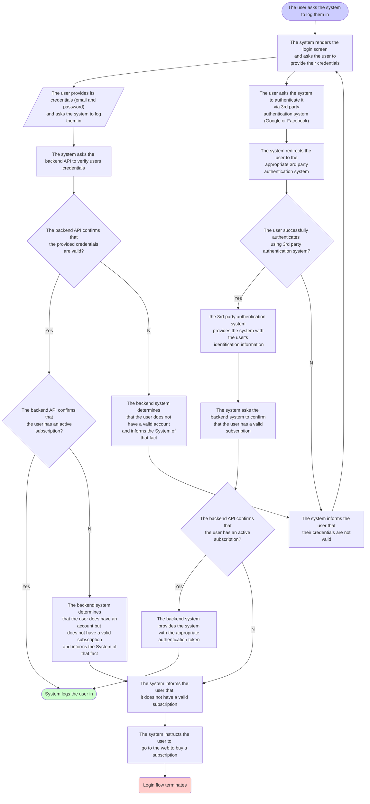

# Specification

# The use case - “The user logs into the system”
## Trigger Event
A user asks the system to log them in

## Main success scenario
The system renders the login screen and asks the user to provide their credentials \
The user provides its credentials (email and password) and asks the system to log them in \
The system asks the backend API to verify users’ credentials \
The backend API confirms that the provided credentials are valid \
The backend API confirms that the user has an active subscription \
The backend API provides the system with an authentication token for the user \
The system logs the user in \
The main success scenario ends.

## Extension 2a: The user authenticates via 3rd party system (Google, Facebook)
2a1. The user asks the system to authenticate it via 3rd party authentication system (Google or Facebook) \
2a2. The system redirects the user to the appropriate 3rd party authentication system \
2a3. The user successfully authenticates using 3rd party authentication system and the 3rd party authentication system provides the system with the user’s identification information \
2a4. The system asks the backend API to confirm that the user has a valid account and a valid subscription \
2a5. The backend API confirms that the user indeed has a valid account and a subscription \
2a6. The backend system provides the system with the appropriate authentication token \
2a7. The main success scenario resumes from step 7

## Extension 2a4a: The user does not have a valid account
2a4a1. The backend system determines that the user does not have a valid account and informs the System of that fact \
2a4a2. The system informs the user that their credentials are not valid \
2a4a3. The main success scenario restarts from step 1

## Extension 2a4b: The user does not have a valid subscription
2a4b1. The backend system determines that the user does have an account but does not have a valid subscription and informs the System of that fact \
2a4b2. The system informs the user that it does not have a valid subscription, and instructs them to go to the web to buy a subscription \
2a4b3. The main success scenario terminates

